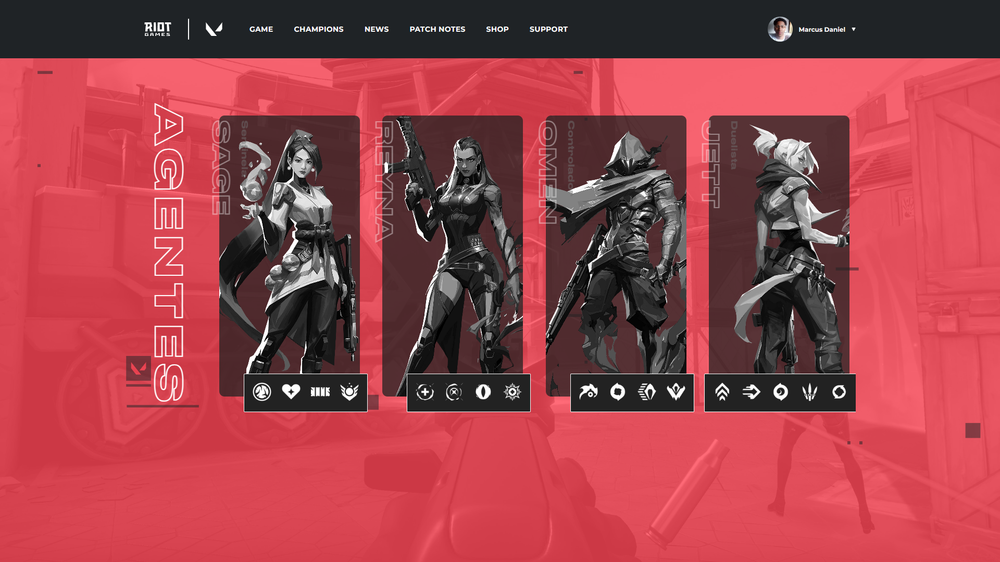

<h1 align="center">
  Valorant
</h1>

  

## 💻 Projeto

# Agentes do Valorant

Bem-vindo ao projeto "Agentes do Valorant"! Este projeto é uma aplicação web desenvolvida para fornecer informações detalhadas sobre os agentes disponíveis no jogo Valorant da Riot Games.

## 🚀 Tecnologias

-  [Next.js](https://nextjs.org/)
-  [Sass](https://sass-lang.com/)
-  [TypeScript](https://www.typescriptlang.org/)
-  [API Valorant](https://valorant-api.com/)

## Estrutura do Projeto

### Estrutura Inicial

Este repositório contém a estrutura inicial do projeto, incluindo um template disponível no GitHub. Você pode clonar este repositório ou baixar o arquivo ZIP para começar a desenvolver.

### Cabeçalho da Aplicação

Para garantir a consistência do código, recomendamos a instalação da extensão ESLint para o Visual Studio Code. Além disso, foi configurado o editor para executar correções automáticas ao salvar o arquivo.

Também é necessário instalar o pacote de ícones `@phosphor-icons/react` para utilizar ícones na aplicação.

### Estrutura do Card do Agente

No diretório `src/data`, você encontrará um arquivo contendo dados do agente Omen, como nome, descrição, papel, retrato e habilidades. Esses dados são usados para construir os cards dos agentes na aplicação.

### Configuração do Next.js

Para permitir o carregamento de imagens de uma fonte externa, configuramos o arquivo `next.config.js` com os domínios permitidos para as imagens.

## Funcionalidades

- Visualização detalhada dos agentes, incluindo suas habilidades e descrições.
- Carrossel para facilitar a navegação entre os agentes.
- Integração com a API oficial do Valorant para garantir dados atualizados.

## Como Contribuir

1. Faça um fork deste repositório.
2. Crie uma branch com a sua feature: `git checkout -b minha-feature`.
3. Faça commit das suas alterações: `git commit -m 'Adicionando nova feature'`.
4. Faça push para a sua branch: `git push origin minha-feature`.
5. Envie um pull request.

## Créditos

- Este projeto foi desenvolvido como parte de um estudo sobre desenvolvimento web com TypeScript e Next.js.

